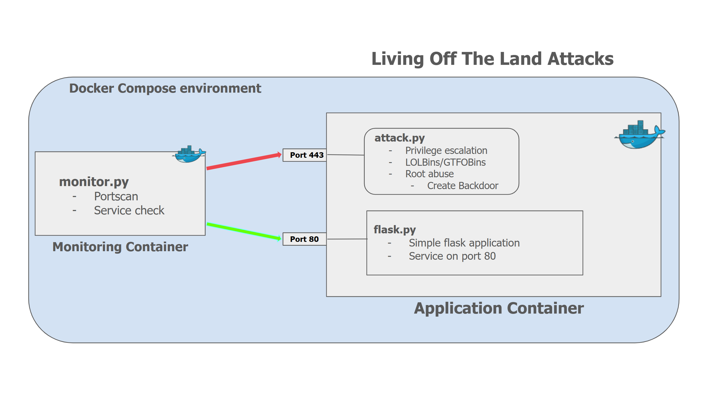

<div class="main-container">

# DART : Dockerized Application Resilience Tester

## Table of Contents
- [Project Initialization](#project-initialization)
- [Project Milestones](#project-milestones)
- [Current Step](#current-step)
- [Next Step](#next-step)

## Project Initialization
Begin by setting up the environment. This section details:
- Cloning the repository
- Installing necessary dependencies
- Setting up Docker for containerized execution

```bash
# Clone the repository and navigate into it
git clone https://github.com/UH-Capstone-Cyber-Analytics/LoTL-attack-lab.git
cd LoTL-attack-lab

# Build and start the Docker containers
docker-compose up --build
```

## Project Milestones

- [x] **Project Initialization** – Environment set up and core repository structure defined.
- [x] **Deploy Simple Flask Application** – Implemented basic Flask application for testing purposes, which later serves as the target container.
- [x] **SQL Attack Implementation** – Basic SQL injection attack demonstrated.
- [ ] **Implementing LoTL Attack (In Progress)** – Conducting LoTL attacks by leveraging container configuration for privileged access.
    - [x] Create an attack script to run within the Application Container to validate attack methods:
        - Privilege escalation
        - Using LOLBins/GTFOBins
        - Exploiting root privileges (e.g., creating a backdoor)
    - [x] Develop a monitoring container to track the Application Container’s status and detect suspicious activities (e.g., port scans, service checks).
    - [ ] Extend the attack script to enable container-to-container attacks.
    - [ ] Implement internal monitoring within the Application Container, sending logs to an external monitoring system:
        - Monitoring root access and shell commands
        - Checking application endpoints
    - [ ] Update the monitoring container to communicate with the internal monitor and analyze logs for potential security issues.
- [ ] **GUI Development** – Create a graphical user interface for the Monitor, Attack, and Application components.
- [ ] **Final Testing & Deployment** – Continuous testing and refinement.

## Current Step

*Figure 1: Present architecture*

## Next Step

*Figure 2: Target architecture*

</div>
